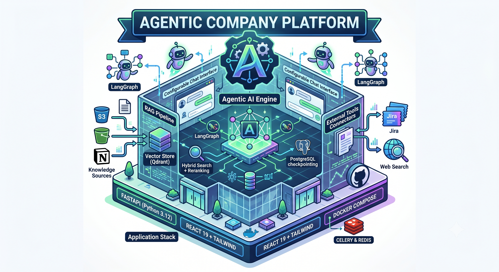

# Agentic Company Platform



An agentic AI platform for internal company use. It provides a configurable chat interface backed by LangGraph agents, a RAG pipeline over documents ingested from knowledge sources (e.g. S3, Notion), and connectors to external tools like Jira.

## Stack

- **Backend:** FastAPI (Python 3.12), SQLAlchemy async ORM, Alembic migrations
- **Frontend:** React 19 + Vite + TailwindCSS + Zustand
- **Agent Engine:** LangGraph with PostgreSQL-based checkpointing
- **Vector Store:** Qdrant (hybrid search (dense + sparse) + reranking)
- **Task Queue:** Celery with Redis
- **Infra:** Docker Compose (more to come for real deployment)

## Architecture

### Backend (`backend/`)
- **API layer** (`app/api/`): REST endpoints for auth, chat (SSE streaming), conversations, admin agents, knowledge sources, and connector credentials.
- **Agent runtime** (`app/agents/`): A compiled LangGraph that routes messages to agent nodes. Each agent is configured via `AgentSettings` in the DB and can bind to specific knowledge sources and tools (`retrieve`, `web_search`, `create_jira_ticket`).
- **RAG pipeline** (`app/services/rag.py`): Chunking, embedding (FastEmbed), storage in Qdrant, and retrieval with Cohere or BGE reranking.
- **Connectors** (`app/services/`): Jira, Notion, and S3 file ingestion. Credentials are encrypted at rest with Fernet.
- **Database:** PostgreSQL with asyncpg. Migrations managed by Alembic.

### Frontend (`frontend/`)
- **Pages:** Chat interface, admin dashboards for agents/knowledge sources/connectors, login. Nore to come
- **State:** Zustand for auth and global state.
- **API client:** `src/lib/api.ts` handles REST calls and SSE consumption.

## Services (Docker Compose)

| Service | Role | Port |
|---|---|---|
| `postgres` | Primary database | 5433 |
| `qdrant` | Vector database | 6333 |
| `redis` | Celery broker / cache | 6379 |
| `backend` | FastAPI app | 8000 |
| `frontend` | Vite dev server | 5173 |
| `celery-worker` | Background task worker | — |
| `celery-beat` | Periodic task scheduler | — |

## Setup

1. **Copy environment variables:**
   ```bash
   cp .env.example .env
   # Edit .env and fill in API keys (OpenAI and others)
   ```

2. **Run everything:**
   ```bash
   docker compose up --build
   ```

3. **Run migrations (first time or after schema changes):**
   ```bash
   docker compose exec backend uv run alembic upgrade head
   ```

4. **Seed demo data (optional, first time only):**
   ```bash
   docker compose exec backend uv run python scripts/seed_users.py
   ```
   This creates the admin user (from `ADMIN_EMAIL` / `ADMIN_PASSWORD` in `.env`) plus any demo accounts defined in `backend/scripts/demo_users.json` or the `DEMO_USERS` env var. For u to test the app.

5. **Access the app:**
   - Frontend: http://localhost:5173
   - API docs: http://localhost:8000/api/docs

## Key Concepts

- **Agents:** Defined in the registry and stored in `agent_settings`. Each has a slug, system prompt, model, tool list, and optionally linked knowledge sources.
- **Knowledge Sources:** Collections of documents (PDF, DOCX, etc.) that are chunked, embedded, and stored in Qdrant. Agents can be scoped to specific sources.
- **Connectors:** External integrations (Jira, Notion). Credentials are stored encrypted and are used by agent tools at runtime.
- **Context Modes:** Chat supports `quick`, `mid`, and `deep` modes that adjust the retrieval and token budgets for the agent.
